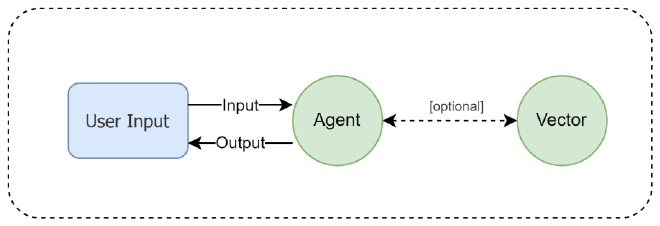
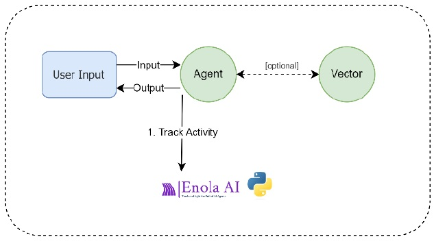

# **Building an Ollama Chatbot**

## **Introduction**

If you want to build a chatbot to integrate it with Enola-AI and use its tracking features, you can follow this guide to build your own chatbot using Ollama, running Llama locally on your machine. Keep in mind, if you already have a chatbot or AI model, you can use that instead.

This guide will help you create a simple chatbot using Ollama, an open-source large language model (LLM), integrated with Enola-AI for advanced tracking and monitoring. The chatbot includes functionalities for:

- Sending Online Chat Data
- Sending Multiple Tasks
- Sending File Information
- Sending API Information
- Sending Cost Information

You will also be able to call the primary fuction of this chatbot from an external script, sending a Question and receiving a Response from the chatbot.

To contextualize, the chatbot plays the role of an Agent, receiving an Input from the User and returning an Output to the User.

Basic architecture with AI solution:



Basic architecture with Enola-AI and Tracking feature:



By the end of this guide, you will have a fully functional chatbot that tracks and logs data to the Enola-AI platform.

---

## **Prerequisites**

- **Python 3.7+**
- **Enola-AI API Token**
- **Ollama**

---

## **Step 1: Set Up the Environment**

#### **1.1 Install Ollama**

- Follow the [Ollama Installation Guide](https://github.com/ollama/ollama) to install and set up Ollama.
- Ensure that Ollama is running and accessible via the API endpoint `http://localhost:11434/`.
- Ollama 3.2 is being used in this guide. If you use a different version, make sure to replace the `model` version appropriately.

#### **1.2 Install Required Python Packages**

Open your terminal and run:

```bash
pip install langchain enola dotenv uuid langchain_ollama
```

This will install Enola-AI library, other necessary libraries and LangChain (a framework that helps facilitate the integration of large language models into applications).

#### **1.3 Set Up the Enola-AI API Token**

1. Create a `.env` file in your project directory.
2. Add your Enola-AI API token:

   ```plaintext
   ENOLA_TOKEN=your_api_token
   ```

**Note: for a comprehensive explanation about loading Enola-AI token, you can visit our [Getting Started](https://github.com/HuemulSolutions/Enola-AI#5-getting-started) section from the Enola-AI documentation**

---

## **Step 2: Create the Chatbot Script**

#### **2.1 Create a Python Script**

- Create a file named `ollama_chatbot.py`.
- Copy and paste the provided code into this file.

**Note: for the example codes in Enola-AI documentation, `ollama_chatbot.py` will be assumed as the class containing the chatbot logic. This is relevant when you require to invoke this class from another class.**

#### **Complete Example: Building an Ollama Chatbot**

```python
# Import necessary libraries
import os
import uuid
from dotenv import load_dotenv
from langchain_ollama import OllamaLLM

# Import Enola modules
from enola.tracking import Tracking
from enola.enola_types import ErrOrWarnKind

# Load .env file with the token inside
load_dotenv()

# Set up your Enola token
token = os.getenv("ENOLA_TOKEN")

# Generate a session_id (remains the same for the entire chat session)
session_id = str(uuid.uuid4())

# Define the function for invoking the answer from the model
def ollama_chat(prompt, model="llama3.2"):
    llm = OllamaLLM(model=model)
    response = llm.invoke(prompt)
    return response

# Define the chatbot functions
def chatbot():
    print("Welcome to the Ollama Chatbot!")
    print("Type 'exit' to end the conversation.")

    chat_active = True
    interaction_count = 0  # Counts the number of interactions

    while chat_active:
        user_input = input("You: ")
        if user_input.lower() == "exit":
            print("Goodbye!")
            chat_active = False
            continue  # Exit the loop

        interaction_count += 1

        # Initialize num_iteratons for this interaction
        num_iteratons = 0

        # Create a Tracking object for this interaction
        monitor = Tracking(
            token=token,
            name=f"Ollama Chatbot Interaction {interaction_count}",
            is_test=True,
            app_id="OllamaChatAppConsole",
            user_id="user@example.com",
            session_id=session_id,
            channel_id="console",
            ip="127.0.0.1",
            message_input=user_input  # user input
        )

        # Step 1: Validate User Input
        num_iteratons += 1  # num_iteratons = 1
        step_validate_input = monitor.new_step("Validate User Input")

        if not user_input.strip():
            step_validate_input.add_error(
                id="EmptyUserInput",
                message="User input is empty.",
                kind=ErrOrWarnKind.EXTERNAL
            )
            monitor.close_step_others(
                step=step_validate_input,
                successfull=False,
                message_output="User input is empty."
            )
            print("Please enter a valid input.")

            # Execute the monitor with the current num_iteratons
            monitor.execute(
                successfull=False,
                message_output="User input is empty.",
                num_iteratons=num_iteratons
            )
            continue  # Skip to the next iteration
        else:
            monitor.close_step_others(
                step=step_validate_input,
                successfull=True,
                message_output="User input is valid."
            )

        # Step 2: User Interaction
        num_iteratons += 1  # num_iteratons = 2
        step_chat = monitor.new_step(f"User Interaction {interaction_count}")

        # Set the message_input attribute of the step to the user input
        step_chat.message_input = user_input

        try:
            # Initialize variables
            file_content = None
            response = ""

            # Check if the user wants to upload a file
            if user_input.lower().startswith("upload file"):
                # Extract file path from the command if provided
                parts = user_input.split(maxsplit=2)
                if len(parts) == 3:
                    file_path = parts[2]
                else:
                    file_path = input("Please enter the file path: ")

                # Process the file
                try:
                    with open(file_path, 'r') as file:
                        file_content = file.read()

                    # Add file information to the step
                    step_chat.add_file_link(
                        name=os.path.basename(file_path),
                        url=file_path,
                        type=os.path.splitext(file_path)[1],
                        size_kb=os.path.getsize(file_path) / 1024,
                        description=f"User uploaded file from local path: {file_path}"
                    )

                    # Simulate processing the file content
                    response = f"File '{os.path.basename(file_path)}' uploaded successfully."

                except Exception as e:
                    print(f"Error reading file: {e}")
                    file_content = None
                    response = f"An error occurred while reading the file: {e}"

            else:
                # API call details
                api_name = "Ollama LLM API"
                method = "POST"
                url = "http://localhost:11434/"  # API Endpoint
                headers_sent = {"Content-Type": "application/json"}
                body_sent = {"model": "llama3.2", "prompt": user_input}

                # Add API data to the step before making the call
                import json
                step_chat.add_api_data(
                    name=api_name,
                    method=method,
                    url=url,
                    bodyToSend=json.dumps(body_sent),
                    headerToSend=json.dumps(headers_sent),
                    payloadReceived="",  # Will be updated after the response
                    description="Call to Ollama LLM API."
                )

                # Invoke the LLM to get the response
                response = ollama_chat(user_input)

                # Update payloadReceived with the actual response
                step_chat.add_api_data(
                    name=api_name,
                    method=method,
                    url=url,
                    bodyToSend=json.dumps(body_sent),
                    headerToSend=json.dumps(headers_sent),
                    payloadReceived=response,  # Actual response
                    description="Call to Ollama LLM API."
                )

            # Simulate token counts (replace with actual counts if possible)
            token_input_num = len(user_input.split())  # Simple estimation
            token_output_num = len(response.split())   # Simple estimation
            token_total_num = token_input_num + token_output_num

            # Assume costs (replace with actual calculations if available)
            token_input_cost = token_input_num * 0.0002
            token_output_cost = token_output_num * 0.0002
            token_total_cost = token_input_cost + token_output_cost

            # Close the interaction step with token usage and costs
            monitor.close_step_token(
                step=step_chat,
                successfull=True,
                message_output=response,
                token_input_num=token_input_num,
                token_output_num=token_output_num,
                token_total_num=token_total_num,
                token_input_cost=token_input_cost,
                token_output_cost=token_output_cost,
                token_total_cost=token_total_cost
            )

            # Step 3: Validate Model Response
            num_iteratons += 1  # num_iteratons = 3
            step_validate_response = monitor.new_step("Validate Model Response")
            if not response.strip():
                step_validate_response.add_error(
                    id="EmptyModelResponse",
                    message="Model response is empty.",
                    kind=ErrOrWarnKind.INTERNAL
                )
                monitor.close_step_others(
                    step=step_validate_response,
                    successfull=False,
                    message_output="Model response is empty."
                )
                print("An error occurred while generating the response.")

                # Execute the monitor with the current num_iteratons
                monitor.execute(
                    successfull=False,
                    message_output="Model response is empty.",
                    num_iteratons=num_iteratons
                )
                continue  # Skip to the next iteration
            else:
                monitor.close_step_others(
                    step=step_validate_response,
                    successfull=True,
                    message_output="Model response is valid."
                )

            # Add user's question and model's response to the step
            step_chat.add_extra_info("UserInput", user_input)
            step_chat.add_extra_info("ModelResponse", response)

            print(f"Chatbot: {response}")

        except Exception as e:
            # Register the error in Enola
            step_chat.add_error(
                id="LLMInvocationError",
                message=str(e),
                kind=ErrOrWarnKind.EXTERNAL
            )
            # Close the step as unsuccessful
            monitor.close_step_token(
                step=step_chat,
                successfull=False,
                message_output="Error occurred during LLM invocation."
            )

            # Execute the monitor with the current num_iteratons
            monitor.execute(
                successfull=False,
                message_output="Error occurred during LLM invocation.",
                num_iteratons=num_iteratons
            )

            print("An error occurred while processing your request.")
            continue  # Skip to the next iteration

        # After processing the interaction, execute the monitor to send the data
        monitor.execute(
            successfull=True,  # Overall success status of the interaction
            message_output=response,
            num_iteratons=num_iteratons  # Total number of steps in this interaction
        )

if __name__ == "__main__":
    chatbot()
```

---

## **Step 3: Understanding the Code**

Let's break down the code to understand how it works and how it meets the required functionalities.

#### **3.1 Imports and Setup**

- **Imports**: The script imports necessary modules, including `os`, `uuid`, and modules from `enola` and `langchain_ollama`.
- **Load Environment Variables**: The `dotenv` module loads the `.env` file containing your Enola-AI API token.
- **Enola-AI Token**: Retrieves the Enola-AI API token from the environment variable.
- **Session ID**: Generates a unique `session_id` for the chat session.
- **Interaction Counter**: Initializes `interaction_count` to track the number of interactions.

#### **3.2 Defining the Ollama Chat Function**

```python
# Define the function for invoking the answer from the model
def ollama_chat(prompt, model="llama3.2"):
    llm = OllamaLLM(model=model)
    response = llm.invoke(prompt)
    return response
```

- **Purpose**: Invokes the Ollama LLM with the user's prompt and returns the response.

**Note**: The function `ollama_chat` can be invoked from another Python script to obtain a response from the model.

Example:
```python
# another_script.py

from ollama_chatbot import ollama_chat # Replace ollama_chatbot with your chatbot Python class

user_input = "What is the capital of France?"
response = ollama_chat(user_input)
print("Response:", response)
```

#### **3.3 The Chatbot Function**

```python
# Define the chatbot functions
def chatbot():
    print("Welcome to the Ollama Chatbot!")
    print("Type 'exit' to end the conversation.")

    chat_active = True
    interaction_count = 0  # Counts the number of interactions

    while chat_active:
        user_input = input("You: ")
        # ...
```

- **Per-Interaction Tracking**: For each user interaction, a new `Tracking` object is created. This ensures that each question and answer pair is tracked as a separate interaction in Enola-AI.
- **Session Consistency**: The `session_id` remains the same across all interactions, linking them under the same session.

#### **3.4 Handling User Input**

- **User Prompt**: The chatbot prompts the user for input and checks if the user wants to exit.
- **Interaction Counter**: Increments `interaction_count` for each new interaction.
- **Initialize `num_iteratons`**: Resets `num_iteratons` to 0 at the start of each interaction.

#### **3.5 Creating Interaction Steps**

```python
# Create a Tracking object for this interaction
monitor = Tracking(
    token=token,
    name=f"Ollama Chatbot Interaction {interaction_count}",
    is_test=True,
    app_id="OllamaChatAppConsole",
    user_id="user@example.com",
    session_id=session_id,
    channel_id="console",
    ip="127.0.0.1",
    message_input=user_input  # user input
)
```

- **New Tracking Object**: A new `monitor` instance is created for each interaction.
- **Message Input**: The user's question is set as the `message_input` of the `Tracking` object.

#### **3.6 Validating User Input**

```python
# Step 1: Validate User Input
num_iteratons += 1  # num_iteratons = 1
step_validate_input = monitor.new_step("Validate User Input")

if not user_input.strip():
    # Handle empty input
    # ...
else:
    # Input is valid
    # ...
```

- **Validation Step**: A new step is created to validate the user input.
- **Error Handling**: If the input is empty, an error is logged, and the interaction is terminated.

#### **3.7 Processing User Commands**

- **File Upload Handling**:

  ```python
  if user_input.lower().startswith("upload file"):
      # Handle file upload
      # ...
  ```

  - If the user wants to upload a file, the chatbot processes the file and logs file information with Enola-AI.

  Example of user input to upload a file:

  ```bash
  upload file /path/to/your/file.txt
  ```

- **LLM Interaction**:

  ```python
  else:
      # API call details
      # ...
      # Invoke the LLM to get the response
      response = ollama_chat(user_input)
      # ...
  ```

  - If the input is a regular message, the chatbot interacts with the Ollama LLM and logs API call details.

  Example of user input to chat with the LLM:

  ```bash
  What is binary code?
  ```

#### **3.8 Validating Model Response**

```python
# Step 3: Validate Model Response
num_iteratons += 1  # num_iteratons = 3
step_validate_response = monitor.new_step("Validate Model Response")
if not response.strip():
    # Handle empty response
    # ...
else:
    # Response is valid
    # ...
```

- **Validation Step**: A step to validate the LLM's response.
- **Error Handling**: If the response is empty, an error is logged, and the interaction is terminated.

#### **3.9 Logging Additional Information**

- **Model Response**: The LLM's response is added to the step's extra info.
- **Token Counts and Costs**: Simulated token usage and costs are calculated and included when closing the step.

#### **3.10 Closing Steps and Finalizing Tracking**

- **Closing Steps**: Each step is properly closed using `monitor.close_step_token()` or `monitor.close_step_others()`.
- **Monitor Execution**: After processing the interaction, `monitor.execute()` is called to send the collected data to Enola-AI.

---

## **Step 4: Running the Chatbot**

#### **4.1 Replace Placeholder Values**

- **Enola-AI Token**: Ensure your `.env` file contains your actual Enola-AI API token.
- **Ollama Model**: Ensure the model name (`"llama3.2"`) matches the model installed on your Ollama instance.

#### **4.2 Start the Chatbot**

- Execute the script or open your terminal and navigate to the directory containing `ollama_chatbot.py`.
- Run the chatbot:

  ```bash
  python ollama_chatbot.py
  ```

- Interact with the chatbot as prompted.

---

## **Step 5: Using the Chatbot**

#### **5.1 Regular Conversation**

- Type in your messages and receive responses from the chatbot.
- Example:

  ```
  You: Hello, how are you?
  Chatbot: [Response from Ollama LLM]
  ```

#### **5.2 Uploading a File**

- **Option 1**: Provide the file path directly in the command.

  ```
  You: upload file /path/to/your/file.txt
  Chatbot: File 'file.txt' uploaded successfully.
  ```

- **Option 2**: Type `upload file` and provide the file path when prompted.

  ```
  You: upload file
  Please enter the file path: /path/to/your/file.txt
  Chatbot: File 'file.txt' uploaded successfully.
  ```

#### **5.3 Ending the Chat Session**

- Type `exit` to end the conversation.

---

## **Step 6: Understanding How the Chatbot Meets the Requirements**

### **6.1 Sending Online Chat Data**

- **Implementation**: Each user input and the corresponding LLM response are captured and sent to Enola-AI as separate interactions.
- **Code Snippet**:

  ```python
  # Create a Tracking object for this interaction
  monitor = Tracking(
      # ...
      message_input=user_input  # user input
  )

  # Add user's question and model's response to the step
  step_chat.add_extra_info("UserInput", user_input)
  step_chat.add_extra_info("ModelResponse", response)
  ```

### **6.2 Sending Multiple Tasks**

- **Implementation**: The chatbot validates user input and model responses in separate steps within each interaction.
- **Code Snippet**:

  ```python
  # Step 1: Validate User Input
  num_iteratons += 1
  step_validate_input = monitor.new_step("Validate User Input")
  # ...

  # Step 2: User Interaction
  num_iteratons += 1
  step_chat = monitor.new_step(f"User Interaction {interaction_count}")
  # ...

  # Step 3: Validate Model Response
  num_iteratons += 1
  step_validate_response = monitor.new_step("Validate Model Response")
  # ...
  ```

### **6.3 Sending File Information**

- **Implementation**: When the user uploads a file, file details are logged in the interaction.
- **Code Snippet**:

  ```python
  # Add file information to the step
  step_chat.add_file_link(
      name=os.path.basename(file_path),
      url=file_path,
      type=os.path.splitext(file_path)[1],
      size_kb=os.path.getsize(file_path) / 1024,
      description=f"User uploaded file from local path: {file_path}"
  )
  ```

### **6.4 Sending API Information**

- **Implementation**: API call details to the local Ollama LLM are recorded within each interaction.
- **Code Snippet**:

  ```python
  # Add API data to the step before making the call
  step_chat.add_api_data(
      name=api_name,
      method=method,
      url=url,
      bodyToSend=json.dumps(body_sent),
      headerToSend=json.dumps(headers_sent),
      payloadReceived="",  # Will be updated after the response
      description="Call to Ollama LLM API."
  )

  # Update payloadReceived with the actual response
  step_chat.add_api_data(
      name=api_name,
      method=method,
      url=url,
      bodyToSend=json.dumps(body_sent),
      headerToSend=json.dumps(headers_sent),
      payloadReceived=response,  # Actual response
      description="Call to Ollama LLM API."
  )
  ```

### **6.5 Sending Cost Information**

- **Implementation**: Token usage and estimated costs are calculated and included when closing the step in each interaction.
- **Code Snippet**:

  ```python
  # Simulate token counts (replace with actual counts if possible)
  token_input_num = len(user_input.split())  # Simple estimation
  token_output_num = len(response.split())   # Simple estimation
  token_total_num = token_input_num + token_output_num

  # Assume costs (replace with actual calculations if available)
  token_input_cost = token_input_num * 0.0002
  token_output_cost = token_output_num * 0.0002
  token_total_cost = token_input_cost + token_output_cost

  # Close the interaction step with token usage and costs
  monitor.close_step_token(
      step=step_chat,
      successfull=True,
      message_output=response,
      token_input_num=token_input_num,
      token_output_num=token_output_num,
      token_total_num=token_total_num,
      token_input_cost=token_input_cost,
      token_output_cost=token_output_cost,
      token_total_cost=token_total_cost
  )
  ```

---

## **Step 7: Monitoring with Enola-AI**

#### **7.1 Accessing the Enola-AI Dashboard**

- Log into your Enola-AI account.
- Navigate to the Agent Executions section.

#### **7.2 Reviewing the Interactions**

- Each interaction (question and answer pair) is tracked separately.
- Locate the tracking data for your interactions.
- **Interaction Details**: You should see individual entries representing each interaction.
- **Steps**: Within each interaction, steps such as "Validate User Input", "User Interaction", and "Validate Model Response" are recorded.

#### **7.3 Analyzing the Data**

- **User Input**: The user input is available in the `message_input` field of the `Tracking` object and under "UserInput" in extra info.
- **Model Response**: The assistant's response is available in the `message_output` and under "ModelResponse" in extra info.
- **File Information**: If you uploaded files, their details are under the respective interaction steps.
- **API Information**: API call details are logged under each interaction step.
- **Cost Information**: Token usage and estimated costs are included in each interaction.

---

## **Conclusion**

By following this guide, you've successfully built a chatbot using Ollama and integrated Enola-AI tracking to monitor interactions comprehensively. This chatbot demonstrates some of the important functionalities that Enola-AI has to offer, providing valuable insights into user interactions and system traceability.
Additionally, you can use the primary fuction of this chatbot from an external script, sending a Question and receiving a Response from the chatbot.
This allows you to try by yourself and understand the different features from Enola-AI.