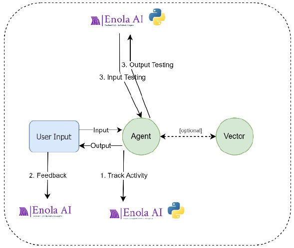

## 6.4. Extracting Information

Enola-AI allows you to retrieve the Input and Output data from previous executions for analysis or further manual and automatic processing. 



Here's a simple example demonstrating how to extract information using Python.

**Note: Before using the provided codes, make sure you have your Enola-AI token configured:
To configure your token, you can follow the explanation in the [Getting Started](https://github.com/HuemulSolutions/Enola-AI#5-getting-started) section from the Enola-AI documentation.**

### Complete Example: Extracting Information - Get Tracking

```python
# Import necessary libraries
from enola import get_executions
from enola.enola_types import ExecutionEvalFilter
from dotenv import load_dotenv
import os

# Load .env file with token inside
load_dotenv()

# Set up your Enola token
token = os.getenv("ENOLA_TOKEN")

# Create a GetExecutions instance
exec = get_executions.GetExecutions(token=token, raise_error_if_fail=False)

# Define your query parameters
exec.query(
    date_from="2024-10-28T00:00",
    date_to="2024-12-31T23:59",
    limit=20
)

# Retrieve and process data
while exec.continue_execution and exec.get_page_number() < 70:
    result_data = exec.get_next_page()
    print("Page:", exec.get_page_number(), ", Data Length:", len(result_data.data))

    if len(result_data.data) == 0:
        break

    for row in result_data.data:
        # Extract and print details of each execution
        print(f"Execution ID: {row.enola_id}")
        print(f"Start Date: {row.start_dt}")
        print(f"End Date: {row.end_dt}")
        print(f"Successful: {row.successfull}")
        print(f"Agent ID: {row.agent_id}")
        print(f"Agent Name: {row.agent_name}")
        print(f"User ID: {row.user_id}")
        print(f"Session ID: {row.session_id}")
        print(f"Channel: {row.channel}")
        print(f"Message Input: {row.message_input}")
        print(f"Message Output: {row.message_output}")
        print("-------------------------------------")
```

## Explanation

This code demonstrates how to extract execution data from the Enola-AI platform:

1. **Create a `GetExecutions` Instance**: Initialize an instance of `GetExecutions` with your token.

2. **Define Query Parameters**: Use the `query` method to specify the date range, limit, and filters for the executions you want to retrieve.

   - **Date Range**: Retrieve executions from `"2024-10-28T00:00"` to `"2024-12-31T23:59"`.
   - **Limit**: Set a limit of 20 executions per page.

3. **Retrieve and Process Data**: Use a loop to fetch and process each page of results.

   - **Pagination Control**: The loop continues while there are more pages to retrieve and the page number is less than 70.
   - **Data Check**: Break the loop if no data is returned.
   - **Data Extraction**: For each execution, print out key details such as execution ID, dates, success status, agent information, user ID, session ID, channel, and messages.

## Notes

- **Adjust Query Parameters**: You can modify the `date_from`, `date_to`, `limit`, or other parameters in the `query` method to suit your needs.

- **Data Processing**: The code above prints execution details to the console. You can modify the code to process the data as needed for your application, such as storing it in a database or performing analytics.

- **Pagination**: The loop includes a condition to prevent infinite loops (`exec.get_page_number() < 70`). Adjust this limit based on your expected data volume.


## How to Extract Information and Create Systematic Evaluations

When combining the extracting information and evaluations features, you can create systematic evaluations when extracting information.
By following the steps from the Evaluation Feedback section, you can create an evaluation category.
In this case, you can create an evaluation category that will rate a submission based on the length of its text. For this purpose, you can messure the length of the text with a number, this number will be considered as the `value`, and this `value` will be inside a range of different values.
Let's say the higher the `value`, the better:
- 0-100: Very Bad
- 101-200: Bad
- 201-300: Intermediate
- 301-400: Good
- 500-5000: Very Good

This means if you want to send a text with 1000 words, it will be automatically rated as Very Good.

To achieve this, in your Python script you have to add the evaluation logic inside the `for` loop, to send an evaluation every time you retrieve information.
- At the beginning of your code, import the evaluation libraries:
```python
from enola import evaluation
from enola.enola_types import EvalType
# ... your code
```

- At the end of your code (inside the `for` loop), you have to create, add and execute an evaluation:
```python
# ... your code
		# Create an Evaluation Instance
        eval = evaluation.Evaluation(
            token=token,
            eval_type=EvalType.AUTO,
            user_id="auto_123",
            user_name="auto",
        )

        # Add an Evaluation
        eval.add_evaluation(
            enola_id=row.enola_id,
            eval_id="003",
            value=len(row.message_output),
            comment=""
        )

        result = eval.execute()
```
		
## Complete Example: Extract Information and Create Systematic Evaluations

Here is the complete example code after combining both features:

```python
# Import necessary libraries
from enola import get_executions
from enola import evaluation
from enola.enola_types import EvalType
from dotenv import load_dotenv
import os

# Load .env file with token inside
load_dotenv()

# Set up your Enola token
token = os.getenv("ENOLA_TOKEN")

# Create a GetExecutions instance
exec = get_executions.GetExecutions(token=token, raise_error_if_fail=False)

# Define your query parameters
exec.query(
    date_from="2024-10-28T00:00",
    date_to="2024-12-31T23:59",
    limit=20
)

# Retrieve and process data
while exec.continue_execution and exec.get_page_number() < 70:
    result_data = exec.get_next_page()
    print("Page:", exec.get_page_number(), ", Data Length:", len(result_data.data))

    if len(result_data.data) == 0:
        break

    for row in result_data.data:
        # Extract and print details of each execution
        print(f"Execution ID: {row.enola_id}")
        print(f"Start Date: {row.start_dt}")
        print(f"End Date: {row.end_dt}")
        print(f"Successful: {row.successfull}")
        print(f"Agent ID: {row.agent_id}")
        print(f"Agent Name: {row.agent_name}")
        print(f"User ID: {row.user_id}")
        print(f"Session ID: {row.session_id}")
        print(f"Channel: {row.channel}")
        print(f"Message Input: {row.message_input}")
        print(f"Message Output: {row.message_output}")
        print("-------------------------------------")

        # Create an Evaluation Instance
        eval = evaluation.Evaluation(
            token=token,
            eval_type=EvalType.AUTO,
            user_id="auto_123",
            user_name="auto",
        )

        # Add an Evaluation
        eval.add_evaluation(
            enola_id=row.enola_id,
            eval_id="003",
            value=len(row.message_output),
            comment=""
        )

        result = eval.execute()
```

By following this example, you should be able to retrieve and evaluate data systematically.

## Summary

With these features you can extract information from the Enola-AI platform. This allows you to access and utilize your execution data for analysis, processing, reporting, evaluating or integrating with other systems.

As demonstrated earlier, the Extract Information feature can also be integrated with Feedback Evaluations to facilitate systematic assessments.