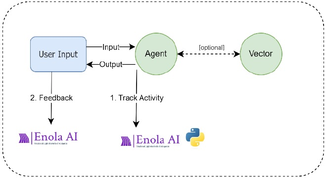

## 6.3. Feedback Evaluation 

Enola-AI provides a feedback system that allows users to evaluate AI agent executions. Feedback can be submitted either through the Enola-AI platform or programmatically via code. This helps in assessing the performance of your AI agents and gathering user and system insights for improvement.

Feedback evaluation is a powerful feature, due to the importance of assessing a system through user feedback. This allows you gain better insights into the quality of the interactions that users are experiencing with the system and their level of satisfaction. By detecting the weak or problematic areas, you will be able to make better decisions to improve your AI solutions.

As shown in the image, Enola-AI provides a Feedback Evaluation feature, enabling you to send evaluation feedback to the Enola-AI servers for further analysis and processing, adding value to the AI system.



By incorporating this feedback mechanism, you can effectively monitor and improve your AI agents based on user and systematic evaluations.


### Submitting Feedback via Code

You can submit feedback using the Enola-AI SDK in Python. Here's a simple example:

**Note: Before using the provided codes, make sure you have your Enola-AI token configured:
To configure your token, you can follow the explanation in the [Getting Started](https://github.com/HuemulSolutions/Enola-AI#5-getting-started) section from the Enola-AI documentation.**

### Step 1: Import Necessary Modules

```python
from enola import evaluation
from enola.enola_types import EvalType
from dotenv import load_dotenv
import os
```

### Step 2: Set Your Enola Token

```python
load_dotenv()
token = os.getenv("ENOLA_TOKEN")
```

### Step 3: Create an Evaluation Instance

Specify the evaluation type (`USER`, `AUTO`, or `INTERNAL`) and user information.
Evaluation types:
- `USER`: Corresponds to evaluations made by the user after an interaction.
- `AUTO`: Corresponds to evaluations that are made automatically by the system.
- `INTERNAL`: Corresponds to evaluations made from internal users when monitoring evaluations.
 
Code example:
```python
eval = evaluation.Evaluation(
    token=token,
    eval_type=EvalType.INTERNAL,
    user_id="internal_123",
    user_name="Internal User",
)
```

### Step 4: Rate an Evaluation

Provide the execution ID (`enola_id`), the ID from the evaluation you are going to use (`eval_id`), an evaluation value (`value`) to rate the evaluation and a `comment`.

Practical example:

You have to evaluate the "Format of the Response".

- Evaluation Name: "Format of the Response"
- Evaluation ID (`eval_id`): "02"
- Evaluation Value (`value`): 95
- Comment (`comment`): "The response was informative and well-structured."

Code example:
```python
eval.add_evaluation(
    enola_id="gr57y84hkc412m...",  # Provide the execution ID (`enola_id`)
    eval_id="02", 			       # Provide the ID from the evaluation
    value=95,  				       # Add a score value between its custom range
    comment="The response was informative and well-structured."
)
```
Parameters explanation:

**enola_id:**

The `enola_id` corresponds to the ID of your Enola interaction.
There are different ways to obtain the `enola_id`:
1. You can get it from an instance of the Tracking() method if you created one previously in your script, by using the parameter enola_id:
	```python
	# ... import necessary modules and load token

	# Initialize a tracking agent
	monitor = Tracking(
		token=token,
		name="My Enola Project",
		is_test=True,
		message_input=user_input # Hello, What can you do?
	)

	# Print the enola_id
	print(monitor.enola_id)
	```

2. You can also get it manually from the Enola-AI platform after checking the details of an interaction, it will appear at the end, under the TAGS section as `Id`.
3. You can extract it via code if it meets your custom criteria by following the steps from the next section [6.4. Extracting Information](extracting_information.md).

**eval_id:**

The `eval_id` corresponds to the ID of the evaluation.
You can use the following Evaluations ID (`eval_id`) that already exist in Enola-AI:
- `0`: General Evaluation
- `02`: Format of the Response (used in this example)
- `REF01`: References
- `003`: Length of the Response
- `004`: Content

It is important that you use an `eval_id` that has been previously defined; otherwise, the evaluation will not work.

**value:**

The `value` corresponds to the rating you will assign to the evaluation, to measure the satisfaction with the interaction.
The `value` has to be inside a custom range defined when an evaluation is created.
In this example, the ranges are configured in the following way (High score is Very Good and Low Score is Very Bad):
- `0-20`: Very Bad
- `21-40`: Bad
- `41-60`: Intermediate
- `61-80`: Good
- `81-100`: Very Good

This means a `value=95` will be considered as Very Good for the "Format of the Response".

Please keep in mind that evaluations can have different ranges, it is important that you use a `value` that is inside the defined scale of the evaluation, you can check them in more details by visiting the Enola-AI platform.

**comment:**

The `comment` is a note you want to leave for this evaluation. You can describe your experience or the level of satisfaction you had with the interaction. The feedback provided here can be useful for further analysis.

### Step 5: Rate an Evaluation by Level

You can also provide an evaluation by `level` instead of a `value`. The evaluation by `level` has a value between `1` (Very Bad) and `5` (Very Good).

```python
eval.add_evaluation_by_level(
    enola_id="gr57y84hkc412m...", # Provide the execution ID (`enola_id`)
    eval_id="02",			      # Provide the ID from the evaluation
    level=5,				      # Add a score level between 1 and 5
    comment="Good response, helpful and concise."
)
```
This approach offers simplicity for the user, by avoiding the need to ask a user to measure with a wider or custom scale. Instead, you measure with only `5` possible options.

### Step 6: Execute the Evaluation Submission

Submit the evaluation to the Enola-AI platform.

```python
result = eval.execute()
```

#### **Complete Example: Feedback Evaluation**
```python
# Import libraries
from enola import evaluation
from enola.enola_types import EvalType
from dotenv import load_dotenv
import os

# Set Your Enola Token
load_dotenv()
token = os.getenv("ENOLA_TOKEN")

# Create an Evaluation Instance
eval = evaluation.Evaluation(
    token=token,
    eval_type=EvalType.INTERNAL,
    user_id="internal_123",
    user_name="Internal User",
)

# Add an Evaluation
eval.add_evaluation(
    enola_id="gr57y84hkc412m...", # Provide the execution ID (`enola_id`)
    eval_id="02", 			      # Provide the ID from the evaluation
    value=95,  				      # Add a score value between its custom range
    comment="The response was informative and well-structured."
)

# Add an Evaluation by Level
eval.add_evaluation_by_level(
    enola_id="gr57y84hkc412m...", # Provide the execution ID (`enola_id`)
    eval_id="02",			      # Provide the ID from the evaluation
    level=5,				      # Add a score level between 1 and 5
    comment="Good response, helpful and concise."
)

# Execute the Evaluation Submission
result = eval.execute()
```

By following these steps, and choosing between an evaluation by `value` or `level`, you can send feedback for evaluations using Python.

### Managing Feedback on the Enola-AI Platform

You can log in to the [Enola-AI platform](https://enola-ai.com/) to view and manage your evaluations. There you can create feedback evaluations, by choosing an interaction in the Agent Executions section and clicking the icon "Create Evaluation". Then you can send the feedback and choose the corresponding parameters.

### Next Steps for Feedback Evaluations

In the next section [6.4. Extracting Information](extracting_information.md), you will learn how to extract information from Enola-AI using Python. This feature is important, as it can be combined with Feedback Evaluations. This means you can retrieve data by obtaining Enola data records that meet specified custom requirements, while also submitting feedback evaluations with scores for each retrieved record. The score will depend on how well each record aligns with your specific requirements.

By leveraging these Enola-AI features, you will be able to customize your own criteria to obtain the data you need and generate systematic feedback evaluations.