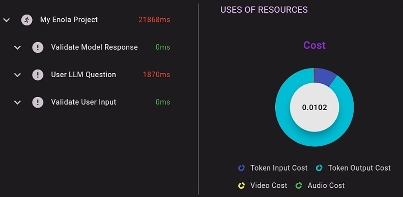

## 6.2. Steps in Enola-AI

In Enola-AI, the concept of **steps** is fundamental for tracking the execution flow of your AI agents. Each step represents a significant action or event in your agent's processing pipeline.

There are two main types of steps:

- **Generic Steps**: Used for general-purpose tracking of actions that are not specific to language models, such as data retrieval, preprocessing, or any custom logic.

- **LLM Steps**: Specifically designed for tracking interactions with Language Models (e.g., GPT-4, Ollama, BERT), where token usage and costs are relevant.

Understanding the difference between these step types is crucial for accurate tracking and cost analysis.

#### Generic Steps

Generic steps are used to track any action or process in your agent that doesn't involve a language model. This could include data retrieval, preprocessing, API calls, or custom computations.

**When to use Generic Steps:**

- Data fetching from databases or APIs.
- Data preprocessing and evaluation.
- Custom computations or business logic.
- Any step where token usage is not applicable.

#### LLM Steps

LLM Steps are used to track interactions with language models where token usage, input/output messages, and costs are important.

**When to use LLM Steps:**

- Sending prompts to a language model.
- Receiving responses from a language model.
- Tracking token counts and associated costs.

#### How to create and close Steps:

To properly use *steps* in Enola-AI, you have to:

1. Create a step
2. Add your custom logic 
3. Close the step (as Generic or LLM)

By following this simple rule, you will be able to manage the steps in Enola-AI. You can create as many steps as you require. In this way, you will be successfully using steps to represent and perform different actions in your tracking workflow. This will allow you to review the steps in the Enola-AI platform in an organized way.

Here is a basic example in Python code showing how you can create steps, add your custom logic and close the steps as *Generic* or *LLM*:

**How to create a Step:**
```python
# Create a step
step_chat = monitor.new_step("Validate User Input")
```

**Add your custom logic:**
```python
# Add your custom logic
# ...Calculating a score using an algorithm (example for Generic step)...
# or
# ...Validating the format from the user input message (example for LLM Step)...
```

**How to close a Step as Generic:**
```python
# Close Step as Generic with monitor.close_step_others
monitor.close_step_others(
    step=example_generic_step,
    successfull=True,
    message_output=model_response
)
```

**How to close a Step as LLM:**

```python
# Close Step as LLM with monitor.close_step_token
monitor.close_step_token(
    step=example_llm_step,
    successfull=True,
    message_output=model_response,
    token_input_num=12,
    token_output_num=15,
    token_total_cost=0.0025,
    token_input_cost=0.001,
    token_output_cost=0.0015
)
```

Here is a basic example on how steps look inside an interaction in the Enola-AI platform:



As shown in the image example, the **steps** are organized inside an **interaction** in the following way:
- My Enola Project (Interaction)
  - Validate Model Response (Step 3)
  - User LLM Question (Step 2)
  - Validate User Input (Step 1)

You can even click the **interaction** and each **step** to get additional information that was tracked during the process.

By understanding steps in Enola-AI, you will be able to create, manage and close steps, allowing you to track and set the interactions inside your AI system.


---

### **Complete Example: Using Steps in Enola-AI**

Here is a simplified example on how to use Steps in the Enola-AI workflow:

- Step 1 (Generic): Validate User Input (validating the user question has the correct format)
- Step 2 (LLM): User LLM Question (interacting with the LLM to get an answer from a question)
- Step 3 (Generic): Validate Model Response (validating the model response has the correct format)

**Note: If you want to try the code by yourself, make sure you have configured your token as explained in section [5. Getting Started](https://github.com/HuemulSolutions/Enola-AI#5-getting-started).** 

```python
from enola.tracking import Tracking
from dotenv import load_dotenv
import os
import uuid
import json
from ollama_chatbot import ollama_chat

# Load .env
load_dotenv()

# Set up your Enola-AI token
token = os.getenv('ENOLA_TOKEN')

# Generate a unique session_id
session_id = str(uuid.uuid4())

user_input = "Hello, What can you do?"

# Initialize the tracking agent
monitor = Tracking(
    token=token,
    name="My Enola Project",
    is_test=True,
    message_input=user_input # Hello, What can you do?
)

# Step 1: Validate User Input
step_validate_input = monitor.new_step("Validate User Input")
# Your code here to validate user input

# Close the user input validation step
monitor.close_step_others(
    step=step_validate_input,
    successfull=True,
    message_output="User input is valid."
)

# Step 2: User LLM Question
step_chat = monitor.new_step("User LLM Question")
# Your code here to interact with the LLM
# response = ollama_chat(user_input) # Example

# Close the LLM step
monitor.close_step_token(
    step=step_chat,
    successfull=True,
    message_output="LLM processing completed.",
    token_input_num=12,
    token_output_num=15,
    token_total_cost=0.0025,
    token_input_cost=0.001,
    token_output_cost=0.0015
)

# Step 3: Validate Model Response
step_validate_response = monitor.new_step("Validate Model Response")
# Your code here to validate the model response

# Close the model response validation step
monitor.close_step_others(
    step=step_validate_response,
    successfull=True,
    message_output="Model response is valid."
)

# Execute the tracking and send the data to Enola-AI server
monitor.execute(
    successfull=True,
    message_output=response, # I can be used in a variety of ways...
    num_iteratons=3 # Total number of steps
)
```