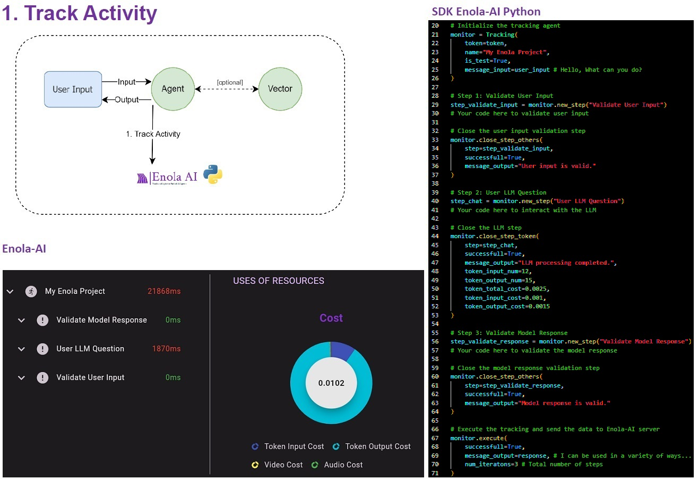
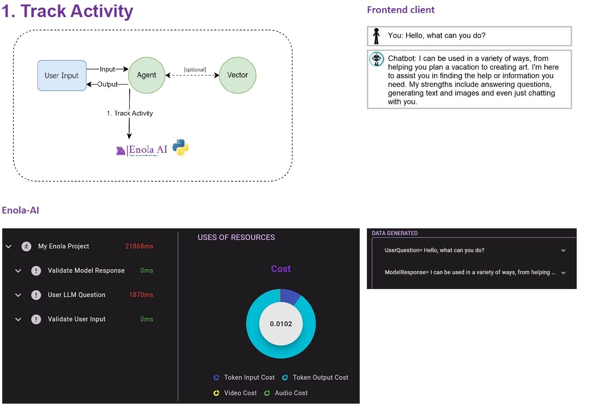

## 6.1. Track Activity

Enola-AI helps you to track the different interactions that are done by the system and the users. This allows you to keep track and monitor your AI solutions.

In a basic AI solution, you would use this architecture:

Basic architecture with AI solution:
- The User sends and Input.
- The Agent returns an Output.

When using Enola-AI, you can add Track Activity, allowing you to track any interactions from the system and users.

Example Track Activity in Python:

Code explanation: 
1. You initialize the Tracking.
2. You validate the user input with Step 1.
3. You ask a question to an LLM Agent with Step 2.
4. You validate the model response with Step 3.
5. You send the data to Enola-AI.

Basic architecture with Enola-AI:
- The User sends and Input.
- The Agent returns an Output.
- Track Activity is sent to Enola-AI.

After doing the Tracking, you can check it in the Enola-AI platform:

By tracking the interactions in your system with Enola-AI, you can effectively monitor, validate and evaluate your models.